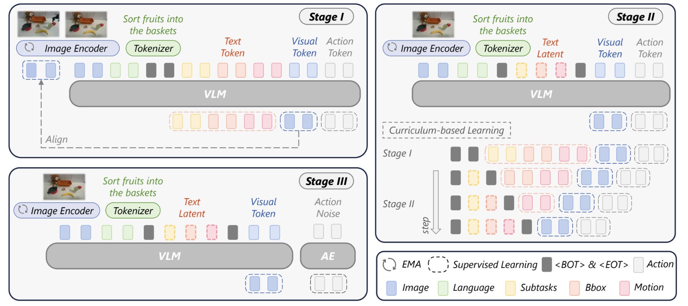
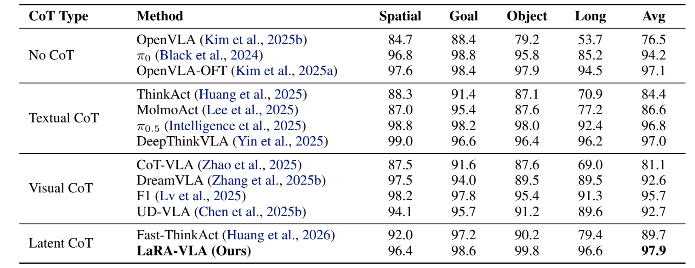
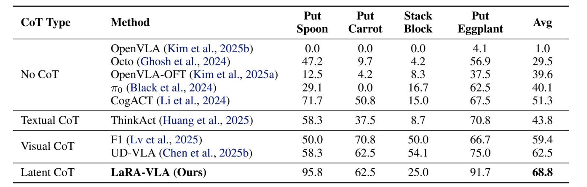

# LaRA-VLA

**Latent Reasoning VLA: Latent Thinking and Prediction for Vision-Language-Action Models**

- Project page: [Latent Reasoning VLA](https://loveju1y.github.io/Latent-Reasoning-VLA/)
- Paper: [arXiv:2602.01166](https://arxiv.org/abs/2602.01166)
- Code: [LoveJu1y/LaRA-VLA](https://github.com/LoveJu1y/LaRA-VLA)

## Release Status

This open-source release currently includes:

- ✅ training code
- ✅ evaluation code
- ⏳ model weights (coming soon)
- ⏳ datasets / processed annotations (coming soon)

## Method Overview

LaRA-VLA is a latent-reasoning VLA project for vision-language-action policy
learning. The public project identity of this repository is **LaRA-VLA**.

The active code namespace in this repository is now `laravla/`.

The current focus of LaRA-VLA is **implicit latent reasoning** for VLA policy
learning.



## Results

### LIBERO



### Bridge



## Installation

```bash
git clone https://github.com/LoveJu1y/LaRA-VLA
cd LaRA-VLA

conda create -n lara-vla python=3.10 -y
conda activate lara-vla

pip install -r requirements.txt
pip install -e .
```

Note: the Python package namespace in this repository is now `laravla`, so
commands such as `from laravla.training.train import main` are expected.

## Quick Start

### 1) Basic check

```bash
python -c "from laravla.training.train import main; print('OK')"
```

### 2) Single-stage training

Bridge:

```bash
bash scripts/run_laravla_bridge.sh
```

LIBERO:

```bash
bash scripts/run_laravla_libero.sh
```

### 3) Multi-stage training (4-stage curriculum)

Bridge:

```bash
bash scripts/run_bridge_multistage.sh
```

LIBERO:

```bash
bash scripts/run_libero_multistage.sh
```

## Evaluation

### LIBERO

```bash
bash examples/LIBERO/eval_libero_all.sh /abs/path/to/checkpoint.pt
```

Batch evaluation for multiple checkpoints:

```bash
bash examples/LIBERO/run_all_ckpts_libero_all.sh
```

### SimplerEnv

Please refer to:

- `examples/SimplerEnv/README.md`
- `examples/SimplerEnv/bridge_eval.sh`

## Notes

- Project name: `LaRA-VLA`
- Code namespace: `laravla/`
- Main training entrypoint: `laravla/training/train.py`
- Most users should run scripts under `scripts/` directly.
- If your local environment needs custom paths or settings, edit the script headers.

## Citation

```bibtex
@article{bai2026latentreasoningvla,
  title={Latent Reasoning VLA: Latent Thinking and Prediction for Vision-Language-Action Models},
  author={Bai, Shuanghao and Lyu, Jing and Zhou, Wanqi and Li, Zhe and Wang, Dakai and Xing, Lei and Zhao, Xiaoguang and Wang, Pengwei and Wang, Zhongyuan and Chi, Cheng and Chen, Badong and Zhang, Shanghang},
  journal={arXiv preprint arXiv:2602.01166},
  year={2026}
}
```

## License

Released under the MIT License. See `LICENSE`.
